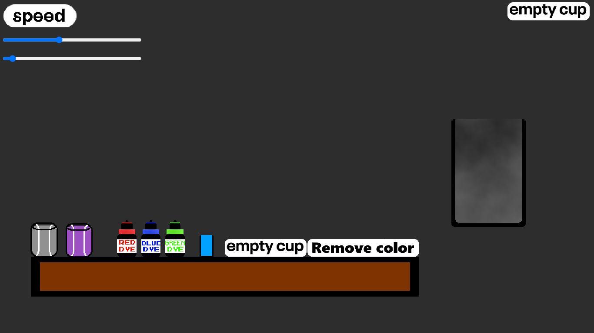

# Potion-Maker  
Create potions by mixing water, dyes, salt, and poison — with adjustable speed!  
Made with 💻 [Construct 2](https://www.construct.net).

## 🧪 Features  
- Pour water into empty cups  
- Mix red, blue, or green dye  
- Add salt or poison to create different effects  
- Adjust pouring **speed** using sliders  
- Reset with “Empty cup” or remove color  
- Visual potion blending in real time  

## 🎮 How to Play  
1. Click on an empty cup  
2. Add water  
3. Choose your ingredients: dyes, salt, or poison  
4. Adjust the pouring speed using the sliders  
5. Watch your potion take form!  
6. Reset or try different combos to discover more colors  

## 🔧 Made With  
- [Construct 2](https://www.construct.net)  
- Pixel-style UI for a clean, fun potion lab  

## 🗂 Project File  
Open the `.capx` file in Construct 2 to see or customize the project.  
You can add new ingredients, effects, or UI improvements!

## 💡 Ideas for Future Updates  
- Save/load potion recipes  
- Add animations and sound effects  
- Unlockable ingredients  
- Potion effects with mini gameplay  

---

Made with constrcut 2 by Pedro & mateus
